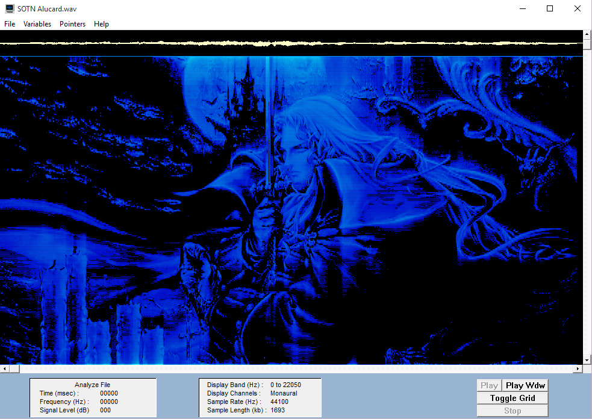

#img2wav

`img2wav` encodes images to 16-bit audio. It supports all Windows GDI+ image formats.

##usage
```
img2wav <bmp|jpg|png|gif|exif|tiff file> <output wave> <pixel rate> 
```

The pixel rate is inversely exponentially proportional to the height of the image. Here's Alucard hiding in a WAV, encoded at 100 pixels per second:
